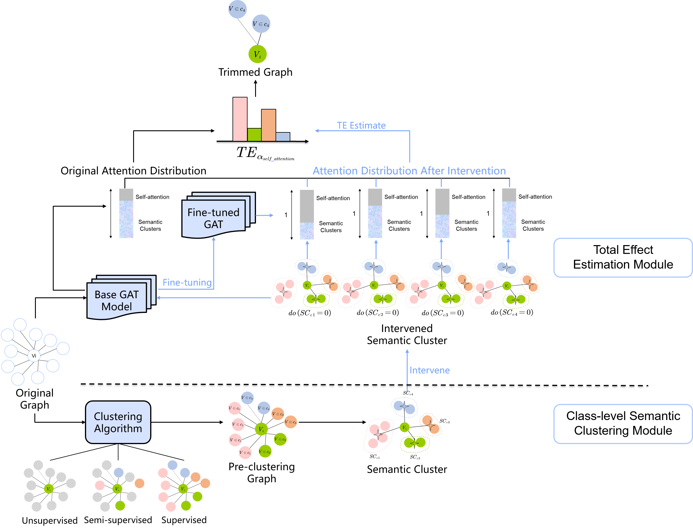
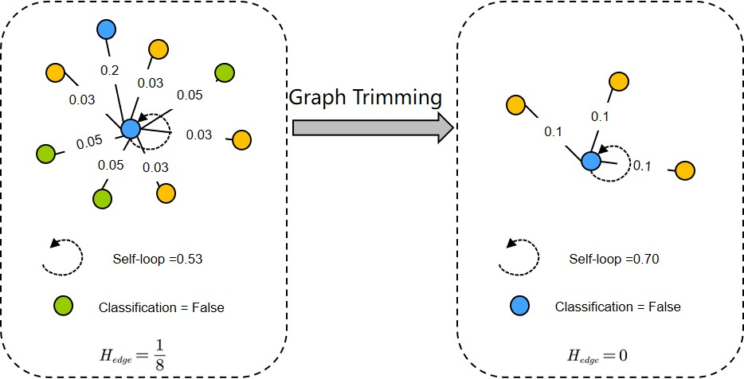
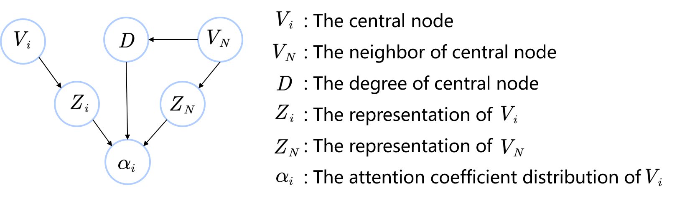

This is a PyTorch implementation of [CAT](https://www.sciencedirect.com/science/article/pii/S0020025524008302) which has been accepted by Information Science.


You can visit the document at [sciencedirect](HTTP://www.sciencedirect.com/science/article/pii/S0020025524008302) or [arXiv](https://arxiv.org/abs/2312.08672).


This work is also a part of our works on graph representation learning and its application for Temporal-Spatial Prediction, called [T-GCN](https://github.com/lehaifeng/T-GCN), from a causality perspective.

## Abstract
The local attention-guided message passing mechanism (LAMP) adopted in graph attention networks (GATs) can adaptively learn the importance of neighboring nodes and perform local aggregation better, thus demonstrating a stronger discrimination ability. However, existing GATs suffer from significant discrimination ability degradations in heterophilic graphs. The reason is that a high proportion of dissimilar neighbors can weaken the self-attention of the central node, resulting in the central node deviating from its similar nodes in the representation space. This type of influence caused by neighboring nodes is referred to as Distraction Effect (DE) in this paper. To estimate and weaken the DE induced by neighboring nodes, we propose a Causal graph Attention network for Trimming heterophilic graphs (CAT). To estimate the DE, since DE is generated through two paths, we adopt the total effect as the metric for estimating DE; To weaken the DE, we identify the neighbors with the highest DE (we call them Distraction Neighbors) and remove them. We adopt three representative GATs as the base model within the proposed CAT framework and conduct experiments on seven heterophilic datasets of three different sizes. Comparative experiments show that CAT can improve the node classification accuracies of all base GAT models. Ablation experiments and visualization further validate the enhanced discrimination ability of CATs. In addition, CAT is a plug-and-play framework and can be introduced to any LAMP-driven GAT because it learns a trimmed graph in the attention-learning stage, instead of modifying the model architecture or globally searching for new neighbors.

## The pipiline
<p align = 'center'>
  
</p>

A toy example:
<p align = 'center'>
  
</p>

The causal graph:
<p align = 'center'>
  
</p>

## How to run
We take the CAT-unsup as an example in the following code. To obtain more CAT variants, you can change the input parameter "--clustering_paradigm" to "sup" or "semi".
1. run and save the base GAT model.
  ```shell
  python run_base_model.py --name_data 'Chameleon' --model_name 'GAT' --hidden_unit 128 --is_attention True
  ```

2. run and save the intervened GAT model.
  ```shell
  python run_intervened_model.py --clustering_paradigm 'unsup' --name_data 'Chameleon' --model_name 'GAT' --hidden_unit 128 --random_state 0 --is_attention True --remove_cluster 0
  python run_intervened_model.py --clustering_paradigm 'unsup' --name_data 'Chameleon' --model_name 'GAT' --hidden_unit 128 --random_state 0 --is_attention True --remove_cluster 1
  python run_intervened_model.py --clustering_paradigm 'unsup' --name_data 'Chameleon' --model_name 'GAT' --hidden_unit 128 --random_state 0 --is_attention True --remove_cluster 2
  python run_intervened_model.py --clustering_paradigm 'unsup' --name_data 'Chameleon' --model_name 'GAT' --hidden_unit 128 --random_state 0 --is_attention True --remove_cluster 3
  python run_intervened_model.py --clustering_paradigm 'unsup' --name_data 'Chameleon' --model_name 'GAT' --hidden_unit 128 --random_state 0 --is_attention True --remove_cluster 4
  ```

3. calculate the TCE and obtain the trimmed graph.
  ```shell
  python TCE.py --data_name 'Chameleon'  --class_num 5 --hidden_unit 128 --random_state 0 --model_name 'GAT' --clustering_paradigm 'unsup'
  ```

## Citation
Thank you for your attention to our work. If this work is helpful to your research, please cite the following paper:
```
@article{HE2024120916,
title = {CAT: A Causal Graph Attention Network for Trimming Heterophilic Graphs},
journal = {Information Sciences},
pages = {120916},
year = {2024},
issn = {0020-0255},
doi = {https://doi.org/10.1016/j.ins.2024.120916},
url = {https://www.sciencedirect.com/science/article/pii/S0020025524008302},
author = {Silu He and Qinyao Luo and Xinsha Fu and Ling Zhao and Ronghua Du and Haifeng Li}
}
```
